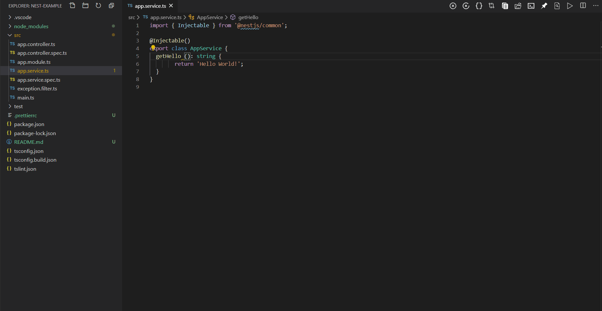

# Shortcuts Panel

Pin, format and manage files all from title bar !

They do the same as these default actions:

| Actions                        | Keyboard Shortcuts
| ------------------------------ |------------------------
| `Keep File Open`    | `Ctrl + K Enter`
| `Format File`    | `Shift + Alt + F`
| `Close All Files` |   `Ctrl + K W`
| `Close Others`    |   `n/a`
| `Toggle Panel`| `Ctrl + J`
| `Open In File Explorer` | `Shift + Alt + R` 
| `Debug` | `Shift + Alt + R` 
| `Open Command Palette` | `Ctrl + Shift + P` 
| `Search Files` | `Ctrl + P` 

## How it works

## Release Notes

### 0.0.1

- Initial release 🎉